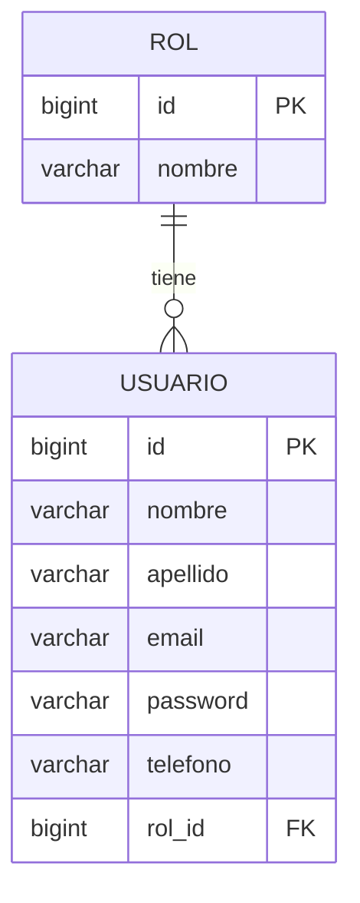

# Diagrama Entidad-Relación - Sistema de Reservas de Tours

## Relación física (dentro de usuarios_db)



## Relaciones logicas entre bases de datos (via OpenFeign / Kafka)

Cada microservicio tiene su propia base de datos (Database per Service). Las relaciones no son FK fisicas, sino referencias logicas (IDs) sincronizadas via OpenFeign (sincrono) o Apache Kafka (asincrono).

```mermaid
erDiagram
    RESERVA }o--|| TOUR : "tourId (Feign)"
    PAGO }o--|| RESERVA : "reservaId (Feign)"
    NOTIFICACION }o--|| RESERVA : "reservaId (Kafka: reserva.creada)"
    NOTIFICACION }o--|| PAGO : "reservaId (Kafka: pago.confirmado)"
    EMBARQUE }o--|| TOUR : "tourId (Feign)"
    MENSAJE }o--|| RESERVA : "reservaId (Feign)"
    NOTIFICACION_PUSH }o--|| USUARIO : "destinatarioId"
    REPORTE }o--o{ RESERVA : "agrega datos diarios"

    TOUR {
        bigint id PK
        varchar nombre
        decimal precio
        int cuposDisponibles
        boolean activo
    }
    RESERVA {
        bigint id PK
        bigint tourId FK_logica
        varchar clienteNombre
        varchar estado
    }
    PAGO {
        bigint id PK
        bigint reservaId FK_logica
        decimal monto
        varchar estado
    }
    NOTIFICACION {
        bigint id PK
        bigint reservaId FK_logica
        varchar mensaje
        varchar estado
    }
    EMBARQUE {
        bigint id PK
        bigint tourId FK_logica
        varchar estado
    }
    MENSAJE {
        bigint id PK
        bigint reservaId FK_logica
        varchar origen
        varchar destino
    }
    NOTIFICACION_PUSH {
        bigint id PK
        bigint destinatarioId FK_logica
        boolean leida
    }
    REPORTE {
        bigint id PK
        date fechaReporte
        int totalReservas
    }
```

## Resumen por microservicio

| Microservicio | Base de Datos | Entidad principal | Relacion fisica (FK) | Relacion logica |
|---|---|---|---|---|
| ms-usuarios | usuarios_db | Usuario, Rol | Usuario.rol_id -> Rol.id (@ManyToOne) | - |
| ms-catalogo-tours | catalogo_db | Tour | - | referenciado por Reserva, Embarque |
| ms-reservas | reservas_db | Reserva | - | tourId -> Tour (Feign) |
| ms-pagos | pagos_db | Pago | - | reservaId -> Reserva (Feign), publica pago.confirmado (Kafka) |
| ms-notificaciones | notificaciones_db | Notificacion | - | consume reserva.creada y pago.confirmado (Kafka) |
| ms-embarques | embarques_db | Embarque | - | tourId -> Tour (Feign) |
| ms-comunicacion-agencia | agencia_db | Mensaje | - | reservaId -> Reserva (Feign) |
| ms-notificaciones-push | notificaciones_push_db | NotificacionPush | - | destinatarioId -> Usuario |
| ms-reportes | reportes_db | Reporte | - | agrega datos de Reserva/Embarque |
| ms-whatsapp | whatsapp_db | MensajeWhatsapp | - | independiente (integracion Twilio) |
